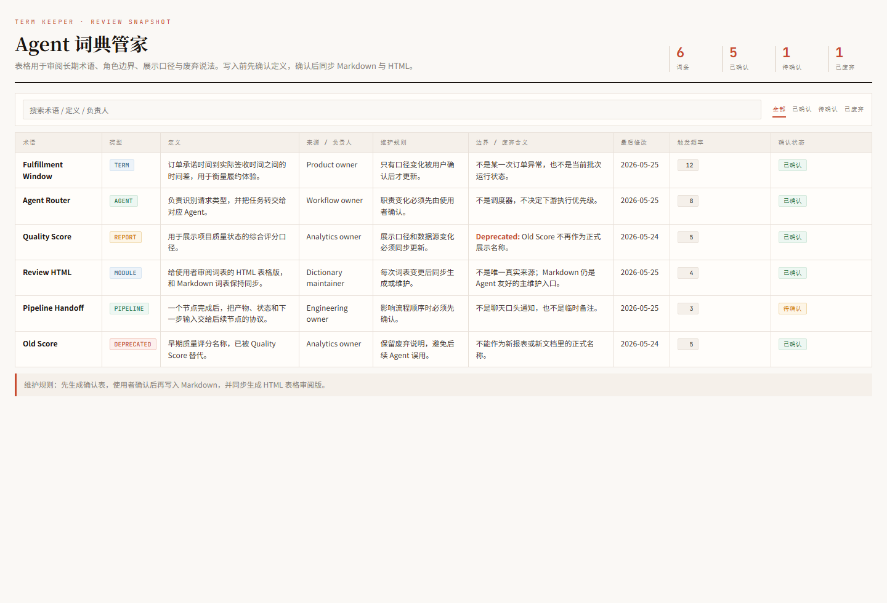
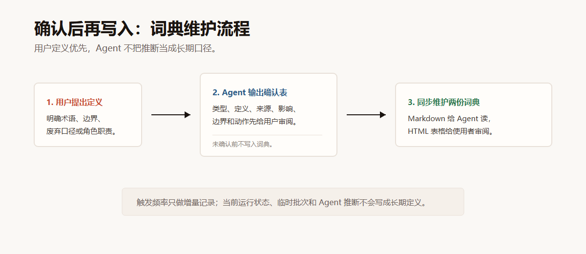

# Term Keeper

A reusable Codex skill for maintaining a project glossary/design dictionary.

[中文说明](README.zh-CN.md) · [Agent-readable version](README.agent.md)

Do you feel that an agent forgets key definitions after context compaction? Do different agents interpret the same term differently from you? Do module names, role boundaries, dashboard metrics, or pipeline terms keep drifting across conversations? This skill gives your project a durable vocabulary layer: Markdown for agents, HTML tables for human review, and confirmation gates before definitions are written.

## What It Solves

- Keeps durable project concepts out of transient chat history.
- Prevents agents from treating guesses as your definitions.
- Preserves business wording, role boundaries, deprecated meanings, and reporting semantics.
- Maintains both an agent-readable Markdown glossary and a human-review HTML table.
- Works across projects without hard-coded repository paths.

## How It Works

1. The user explicitly defines, corrects, renames, or deprecates a durable concept.
2. The agent drafts a confirmation table.
3. The user confirms or corrects the wording.
4. The agent updates both `docs/glossary.md` and `docs/glossary.html`.
5. Optional scripts can render or check the files, but everyday maintenance is done by the agent.

## Best Fit

Use this skill when your project has terms such as:

- Domain vocabulary and business concepts.
- Module names and ownership meanings.
- Agent, role, or workflow boundaries.
- Dashboard metrics and reporting definitions.
- Pipeline states, handoffs, and artifact semantics.
- Deprecated or renamed concepts that agents must not reuse incorrectly.

## Skill Package

The actual skill package is:

```text
skill/term-keeper/
  SKILL.md
  agents/openai.yaml
  examples/demo-glossary.html
  references/dictionary-config-template.md
  references/pressure-test-scenarios.md
  scripts/render_glossary_html.py
  scripts/check_dictionary_sync.py
```

Release files such as this README, screenshots, and license stay outside `skill/term-keeper/`. This keeps the installable skill package focused and lightweight.

## Quick Start

Install the skill into your Codex skills directory, then say something like:

```text
Use term-keeper. Record this definition:
In this project, "Agent Router" means the component that classifies requests and hands them off to the correct agent. It is not a scheduler.
```

The agent should first show a confirmation table. Only after you approve it should the glossary be updated.

## Default Output Files

When no project-specific dictionary exists, the skill defaults to:

```text
docs/glossary.md
docs/glossary.html
```

The Markdown file is the agent-friendly source. The HTML file is a table-first review page for humans.

## Optional Helpers

The bundled Python scripts are optional:

- `skill/term-keeper/scripts/render_glossary_html.py`: renders default Markdown entries into an HTML review table.
- `skill/term-keeper/scripts/check_dictionary_sync.py`: checks whether Markdown and HTML have synchronized terms and selected metadata.

The agent can also edit Markdown and HTML directly. The scripts are useful for tests, CI, release checks, or generated-output workflows.

## Demo

GitHub Pages display page:

```text
https://springrain-i.github.io/term-keeper/
```

The live page works after GitHub Pages is enabled for `main / docs`.

Open the bundled HTML demo locally:

```text
skill/term-keeper/examples/demo-glossary.html
```

It shows the expected table-first review experience with Chinese table headers, last modified date, trigger frequency, confirmation status, and deprecated meanings.

### Screenshots





`demo-glossary-table.png` is captured from `examples/demo-glossary.html`. `confirmation-table-flow.svg` explains the confirmation-first workflow.

## More

- See [INSTALLATION.md](INSTALLATION.md) for setup.
- See [EXAMPLES.md](EXAMPLES.md) for practical prompts.
- See [TESTING.md](TESTING.md) for minimal verification.
- See [README.zh-CN.md](README.zh-CN.md) for Chinese documentation.
- See [README.agent.md](README.agent.md) for agent-facing instructions.
